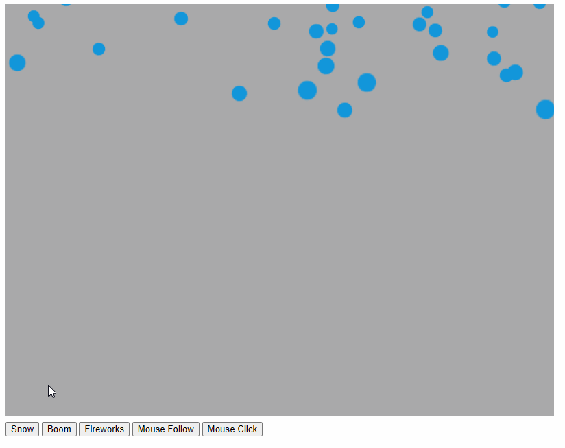

# Micro-ParticleSystem

一个轻量级、高性能的粒子系统库，用于创建各种视觉效果，如烟花、雪花、火焰等粒子效果。

## 特性

- 轻量级：核心代码简洁，无依赖
- 灵活性：可自定义粒子外观、行为和发射模式
- 类型安全：使用TypeScript开发，提供完整类型定义

## 安装

```bash
npm install micro-particalsystem
```

## 使用示例

micro-particalsystem可以在不同环境中使用。以下是两个典型的使用案例：

### HTML DOM 使用示例

使用HTML DOM元素作为粒子，适用于简单的网页特效。

```typescript
import { Emitter, Partical, IFactory } from 'micro-particalsystem';

// 1. 创建自定义粒子类
class DomPartical extends Partical<HTMLElement> {
  protected createElement() {
    this.el = document.createElement("div");
    this.el.className = "partical snow";
  }

  protected resetElement() {
    this.el.style.transform = ``;
  }

  protected updateElement() {
    this.el.style.transform = `translate3d(${this.x}px,${this.y}px, 0) scale(${this.scale})`;
  }
}

// 2. 创建自定义工厂类
class DomFactory extends IFactory<DomPartical, HTMLElement> {
  constructor(public container: HTMLElement) {
    super(container);
  }
  
  newPartical(): DomPartical {
    return new DomPartical();
  }

  addToStage(obj: HTMLElement): void {
    this.container.appendChild(obj);
  }

  removeFromStage(obj: HTMLElement): void {
    this.container.removeChild(obj);
  }
  
  removeAll() {
    this.container.innerHTML = "";
  }
}

// 3. 创建雪花效果
function createSnowEffect(container) {
  const factory = new DomFactory(container);
  
  const snowEmitter = new Emitter<DomPartical, HTMLElement>({
    poolSize: 200,
    maxCount: 200,
    padding: [100, 100, 100, 100],
    bounds: {
      x: 0,
      y: 0,
      width: 800,
      height: 600
    },
    factory,
    particalOptions: {
      angle: { min: Math.PI / 2, max: Math.PI / 2 }, // 向下飘落
      speedStep: { min: 1, max: 2 },                 // 下落速度
      scaleStep: { min: 0, max: 0.01 },              // 缓慢变大
      acceleration: { x: 0, y: 0.02 },               // 下落加速度
      spawnRegion: {                                 // 从顶部产生
        x: 0,
        y: -50,
        width: 800,
        height: 0
      }
    },
    throttle: 2 // 控制产生速率
  });
  
  return snowEmitter;
}

// 4. 使用方式
const container = document.querySelector('.particle-container');
const snowEmitter = createSnowEffect(container);

// 控制粒子系统
// snowEmitter.pause();    // 暂停
// snowEmitter.resume();   // 恢复
// snowEmitter.destroy();  // 销毁
```

### Pixi.js 使用示例

结合Pixi.js创建高性能的粒子效果，适合游戏和复杂动画。

```typescript
import { Emitter, Partical, IFactory } from 'micro-particalsystem';
import * as PIXI from 'pixi.js';

// 1. 创建自定义粒子类
class PixiPartical extends Partical<PIXI.Sprite> {
  protected createElement(): void {
    const texture = PIXI.Texture.from('particle.png'); // 使用精灵纹理
    this.el = new PIXI.Sprite(texture);
    this.el.anchor.set(0.5); // 设置锚点居中
  }

  protected resetElement(): void {
    this.el.x = 0;
    this.el.y = 0;
    this.el.scale.set(1);
  }

  protected updateElement(): void {
    this.el.position.set(this.x, this.y);
    this.el.scale.set(this.scale);
  }
}

// 2. 创建自定义工厂类
class PixiFactory extends IFactory<PixiPartical, PIXI.Container> {
  constructor(public container: PIXI.Container) {
    super(container);
  }

  newPartical(): PixiPartical {
    return new PixiPartical();
  }

  addToStage(obj: PIXI.Sprite): void {
    this.container.addChild(obj);
  }

  removeFromStage(obj: PIXI.Sprite): void {
    this.container.removeChild(obj);
  }

  removeAll(): void {
    this.container.removeChildren();
  }
}

// 3. 创建爆炸效果
function createBoomEffect(container) {
  const factory = new PixiFactory(container);
  
  const boomEmitter = new Emitter<PixiPartical, PIXI.Container>({
    poolSize: 200,
    maxCount: 200,
    padding: [50, 50, 50, 50],
    bounds: {
      x: 0,
      y: 0,
      width: 800,
      height: 600
    },
    factory,
    particalOptions: {
      angle: { min: 0, max: Math.PI * 2 },  // 360度散开
      speedStep: { min: 1, max: 2 },        // 爆炸速度
      scaleStep: { min: -0.01, max: -0.005 }, // 缓慢缩小
      spawnRegion: {                        // 从中心点爆发
        x: 400,
        y: 300,
        width: 0,
        height: 0
      }
    }
  });
  
  return boomEmitter;
}

// 4. 使用方式
const app = new PIXI.Application({
  width: 800,
  height: 600
});
document.body.appendChild(app.view);

// 创建粒子容器
const particleContainer = new PIXI.Container();
app.stage.addChild(particleContainer);

// 创建爆炸效果
const boomEmitter = createBoomEffect(particleContainer);

// 添加交互 - 点击产生爆炸
app.stage.interactive = true;
app.stage.on('pointerdown', (event) => {
  // 更新爆炸位置
  boomEmitter.updateEmitterOptions({
    particalOptions: {
      spawnRegion: {
        x: event.data.global.x,
        y: event.data.global.y,
        width: 0,
        height: 0
      }
    }
  });
  
  // 如果是手动模式，可以创建多个粒子
  for (let i = 0; i < 20; i++) {
    boomEmitter.createPartical();
  }
});
```

## 高级使用案例



micro-particalsystem可以创建多种粒子效果：

1. **雪花效果**：从顶部缓慢飘落的粒子
2. **爆炸效果**：从中心点向四周散开的粒子
3. **烟花效果**：从底部发射，到达顶点后自由落体的粒子
4. **跟随鼠标**：粒子会跟随鼠标位置产生
5. **点击爆发**：鼠标点击位置产生爆发效果

示例效果：
- 雪花效果设置：`angle: { min: Math.PI / 2, max: Math.PI / 2 }`，`acceleration: { x: 0, y: 0.02 }`
- 爆炸效果设置：`angle: { min: 0, max: Math.PI * 2 }`，`speedStep: { min: 1, max: 3 }`
- 烟花效果设置：`angle: { min: -Math.PI * 0.65, max: -Math.PI * 0.35 }`，`acceleration: { x: 0, y: 0.06 }`
- 手动控制：`isManual: true`，通过`createPartical()`手动创建粒子

## 核心类

### Emitter

粒子发射器，负责创建、更新和移除粒子。

#### IEmitterOptions 参数

| 参数名 | 类型 | 必选 | 说明 |
|-------|------|-----|-----|
| poolSize | number | 否 | 粒子对象池大小，默认为30 |
| maxCount | number | 否 | 舞台中最大粒子数量，舞台中粒子数量超过该值时，则不在产生粒子 |
| bounds | IBounds | 否 | 粒子舞台边界，定义了一个矩形区域 |
| padding | [number, number, number, number] | 否 | 粒子发射器边界内边距，会扩大舞台边界区域。解决粒子中心点移动到bounds设置的边界外面时，但是整个粒子并没有离开bounds边界就回收粒子的问题，格式为[上, 右, 下, 左] |
| factory | IFactory<T, C> | 是 | 粒子对象工厂，用于添加粒子对象到舞台中，移除粒子对象到舞台中 |
| particalOptions | IParticalOptions | 是 | 粒子对象参数，定义粒子运行方式 |
| throttle | number | 否 | 粒子发射器节流参数，该值越大，产生粒子的速度越慢 |
| isManual | boolean | 否 | 是否手动发射粒子，默认为false |

#### 方法

- `createPartical()`: 创建一个新粒子
- `pause()`: 暂停粒子系统
- `resume()`: 恢复粒子系统 
- `destroy()`: 销毁粒子系统
- `updateEmitterOptions(options)`: 更新发射器参数

### Partical

粒子基类，定义粒子的基本属性和行为。

#### 参数说明

| 参数名 | 类型 | 说明 |
|-------|------|-----|
| angle | number | 运动角度，决定粒子运动方向 |
| speedStep | number | 运动速度，决定粒子运动快慢 |
| scaleStep | number | 缩放速度，每帧缩放变化量 |
| velocity | IPoint | 速度向量，表示粒子在x和y方向上的速度 |
| acceleration | IPoint | 加速度向量，表示粒子在x和y方向上的加速度 |
| spawnRegion | IBounds | 粒子产生区域，定义了粒子初始位置的矩形范围 |
| x | number | 粒子节点x轴坐标值 |
| y | number | 粒子节点y轴坐标值 |
| scale | number | 粒子节点缩放值，默认为1 |
| el | T | 粒子对象节点，泛型类型 |

#### IParticalOptions 参数

| 参数名 | 类型 | 必选 | 说明 |
|-------|------|-----|-----|
| angle | IRange | 否 | 运动角度范围，粒子将在min和max之间随机获取一个角度 |
| speedStep | IRange | 否 | 初始运动速度范围，粒子将在min和max之间随机获取一个速度 |
| scaleStep | IRange | 否 | 缩放增量范围，粒子将在min和max之间随机获取一个缩放增量 |
| acceleration | IPoint | 否 | 加速度向量，影响粒子的运动轨迹 |
| spawnRegion | IBounds | 否 | 粒子产生的区域，定义了粒子初始位置的矩形范围 |

#### 方法

- `update()`: 更新粒子状态
- `reset(options)`: 重置粒子属性
- `createElement()`: 创建粒子元素（需要子类实现）
- `updateElement()`: 更新粒子元素（需要子类实现）

### IFactory

粒子工厂接口，负责创建粒子和管理粒子在舞台上的添加/移除。

#### 方法

- `newPartical()`: 创建新粒子（需要子类实现）
- `addToStage(obj)`: 将粒子添加到舞台（需要子类实现）
- `removeFromStage(obj)`: 从舞台移除粒子（需要子类实现）
- `removeAll()`: 从舞台移除所有粒子（需要子类实现）

### Pool

对象池，用于减少对象创建和销毁带来的性能损耗。

#### 构造函数

```typescript
constructor(max: number = 30)
```

#### 方法

- `create(fn)`: 从对象池中获取或创建一个对象
- `recyle(item)`: 回收一个对象到对象池

### Ticker

提供帧循环机制，用于更新粒子系统。

#### 方法

- `add(fn, context)`: 添加一个帧更新回调
- `remove(fn, context)`: 移除一个帧更新回调


